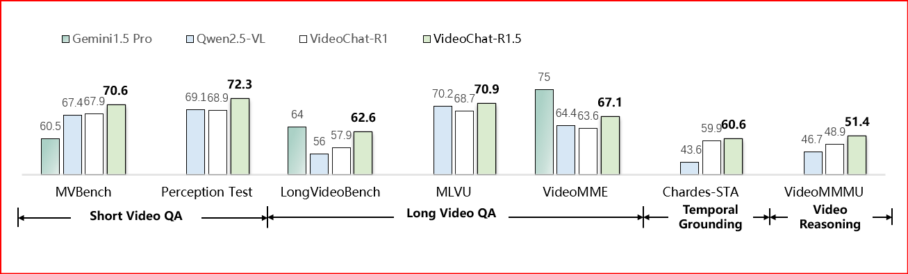
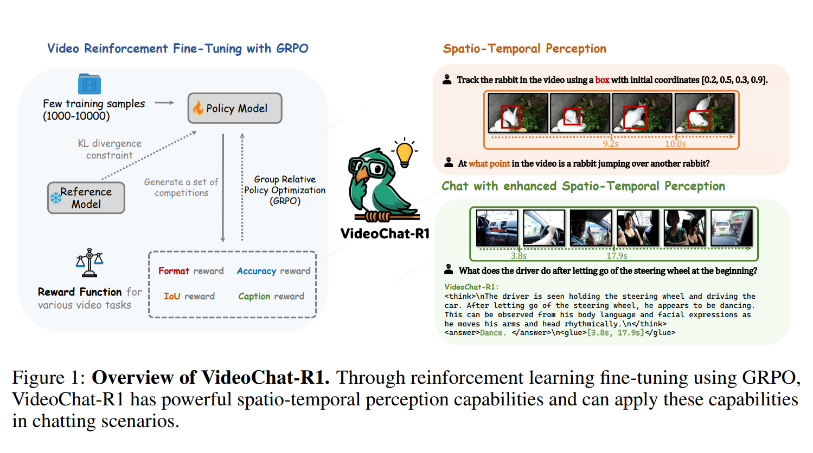
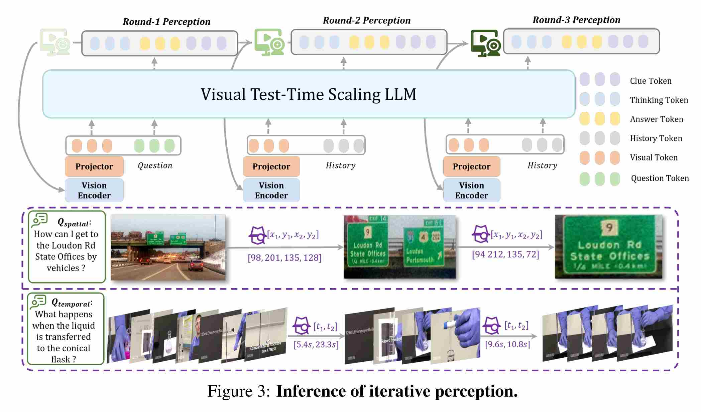

# VideoChat-R1 & -R1.5: Spatio-Temporal RL for Video Perception and Reasoning


## :fire: Updates

- [x] **2025/09/26**:🔥🔥🔥 We release our VideoChat-R1.5 model at [Huggingface](https://huggingface.co/OpenGVLab/VideoChat-R1_5), [paper](https://arxiv.org/pdf/2509.21100), and eval code.
- [x] **2025/09/22**: 🎉🎉🎉 Our VideoChat-R1.5 is accepted by NIPS2025.
- [x] **2025/04/22**:🔥🔥🔥 We release our VideoChat-R1-caption at [Huggingface](https://huggingface.co/collections/OpenGVLab/videochat-r1-67fbe26e4eb08c83aa24643e).
- [x] **2025/04/14**:🔥🔥🔥 We release our VideoChat-R1 and  VideoChat-R1-thinking at [Huggingface](https://huggingface.co/collections/OpenGVLab/videochat-r1-67fbe26e4eb08c83aa24643e).
- [x] **2025/04/10**:🔥🔥🔥 We release our VideoChat-R1 [paper](https://arxiv.org/abs/2504.06958) and code.


## 🎯 Performances on Video Benchmarks



Across short-form & long-form videos, temporal grounding, video reasoning, and spatio-temporal perception, the model delivers consistently stronger results

## :parrot: Introduction



We adopt multi-task joint RL to strengthen the model’s spatio-temporal perception and video reasoning capabilities.




During the inference process, we use the Region of Interest strategy which allows the model to gradually find the video interval of interest. By using multi-step perception, model performance increases with the number of perceptions.

## Demo & Inference

Refer to [hf README](https://huggingface.co/OpenGVLab/VideoChat-R1_7B) to inference our model.

## Evaluation

See [eval_scripts](eval_scripts) and [lmms-eval_videochat](lmms-eval_videochat).
<!-- See [evaluation codes](lmms-eval_videochat). And [lmms-eval](https://github.com/EvolvingLMMs-Lab/lmms-eval) have supported our model, you also could use it to evaluate our model on varous benchmarks. -->

## Training

See [training_scripts](training_scripts).

# :page_facing_up: Citation

If you find this project useful in your research, please consider cite:
```BibTeX
@article{li2025videochatr1,
  title={VideoChat-R1: Enhancing Spatio-Temporal
Perception via Reinforcement Fine-Tuning},
  author={Li, Xinhao and Yan, Ziang and Meng, Desen and Dong, Lu and Zeng, Xiangyu and He, Yinan and Wang, Yali and Qiao, Yu and Wang, Yi and Wang, Limin},
  journal={arXiv preprint arXiv:2504.06958},
  year={2025}
}

@article{yan2025videochatr15,
  title={VideoChat-R1.5: Visual Test-Time Scaling to Reinforce Multimodal Reasoning by Iterative Perception},
  author={Yan, Ziang and Li, Xinhao and He, Yinan and Zhengrong Yue and Zeng, Xiangyu and Wang, Yali and Qiao, Yu and Wang, Limin and Wang, Yi},
  journal={arXiv preprint arXiv:2509.21100},
  year={2025}
}
```


<!-- # :dizzy: Acknowledgement

Thanks to the open source of the following projects: [Qwen](https://github.com/QwenLM/Qwen), [lmms-eval](https://github.com/EvolvingLMMs-Lab/lmms-eval), their implementation provides valuable reference experience for our project. -->
