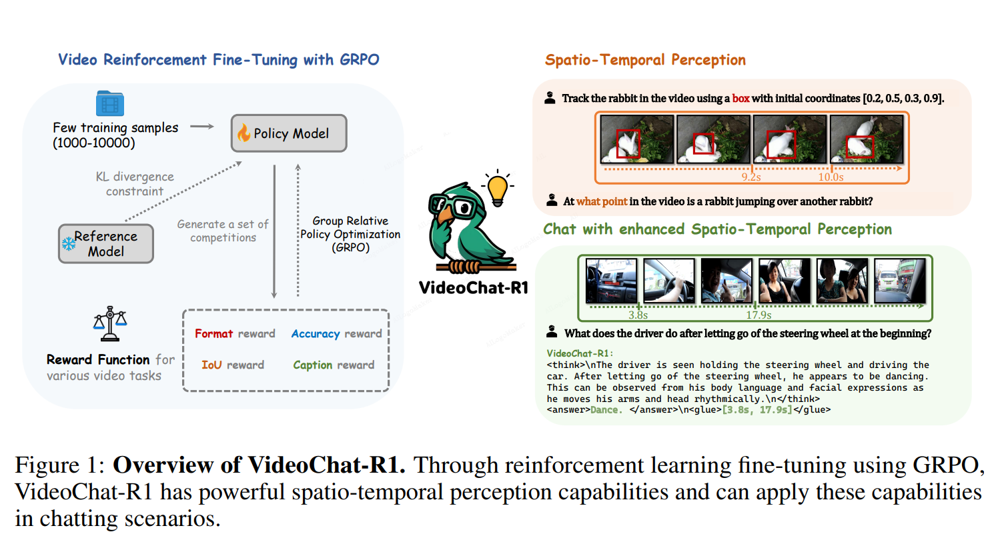

<div align="center">


<h2><a href="https://arxiv.org/pdf/2504.06958">VideoChat-R1: Enhancing Spatio-Temporal
Perception via Reinforcement Fine-Tuning</a></h2>

[Xinhao Li](https://scholar.google.com/citations?user=evR3uR0AAAAJ)\*, [Ziang Yan](https://scholar.google.com.hk/citations?user=78lx13MAAAAJ&hl=zh-CN)\*, Desen Meng, Lu Dong, [Xiangyu Zeng](https://scholar.google.com/citations?user=jS13DXkAAAAJ&hl=zh-CN), [Yinan He](https://dblp.org/pid/93/7763.html), [Yali Wang](https://scholar.google.com/citations?user=hD948dkAAAAJ), [Yu Qiao](https://scholar.google.com/citations?user=gFtI-8QAAAAJ&hl), [Yi Wang](https://scholar.google.com.hk/citations?user=Xm2M8UwAAAAJ)^ and [Limin Wang](https://scholar.google.com/citations?user=HEuN8PcAAAAJ)^

<p align="center">
        🤗 <a href="">Model & Data</a> &nbsp&nbsp | &nbsp&nbsp 📑 <a href="https://arxiv.org/pdf/2504.06958">Paper</a> &nbsp&nbsp 
<br>

</p>


</div>


## :fire: Updates
- [x] **2025/04/10**:🔥🔥🔥 We release our paper and code.


## :parrot: Introduction




## Demo & Inference

TBD
<!-- Refer to [hf README](https://huggingface.co/OpenGVLab/VideoChat-Flash-Qwen2_5-2B_res448) to inference our model. -->

## Evaluation

See [eval_scripts](eval_scripts).
<!-- See [evaluation codes](lmms-eval_videochat). And [lmms-eval](https://github.com/EvolvingLMMs-Lab/lmms-eval) have supported our model, you also could use it to evaluate our model on varous benchmarks. -->

## Training

See [training_scripts](training_scripts).

# :page_facing_up: Citation

If you find this project useful in your research, please consider cite:
```BibTeX
@article{li2025videochatr1,
  title={VideoChat-R1: Enhancing Spatio-Temporal
Perception via Reinforcement Fine-Tuning},
  author={Li, Xinhao and Yan, Ziang and Meng, Desen and Dong, Lu and Zeng, Xiangyu and He, Yinan and Wang, Yali and Qiao, Yu and Wang, Yi and Wang, Limin},
  journal={arXiv preprint arXiv:2504.06958},
  year={2025}
}
```

<!-- # :dizzy: Acknowledgement

Thanks to the open source of the following projects: [Qwen](https://github.com/QwenLM/Qwen), [lmms-eval](https://github.com/EvolvingLMMs-Lab/lmms-eval), their implementation provides valuable reference experience for our project. -->
